# Popcorn & Nachos

        

> 영화 리뷰 및 평점을 바탕으로 한 취향 분석 및 영화 추천 웹 서비스

## Demo

[사이트 바로가기](http://popcornnnachos.s3-website.ap-northeast-2.amazonaws.com/)

## Development

### 🧑‍💻 Developers 

:bust_in_silhouette: **제유빈** :bust_in_silhouette: **권경은**

### :calendar: Schedule

**2020-06-11 ~ 2020-06-19**

###  :computer: Technology Stack

#### :pushpin: Django

* Python - 3.7.4
* Django - 2.1.15
* Django REST Framework

#### :pushpin: SQLite

#### :pushpin: Vue.js

* Vue - 3.0.0
* @vue/cli - 4.3.1

#### :pushpin: AWS Lightsail

* Backend 배포

#### :pushpin: AWS S3

* Frontend 배포	

## About

### :house: [Homepage](http://popcornnnachos.s3-website.ap-northeast-2.amazonaws.com/)

​				:small_red_triangle: 영화 리스트 페이지

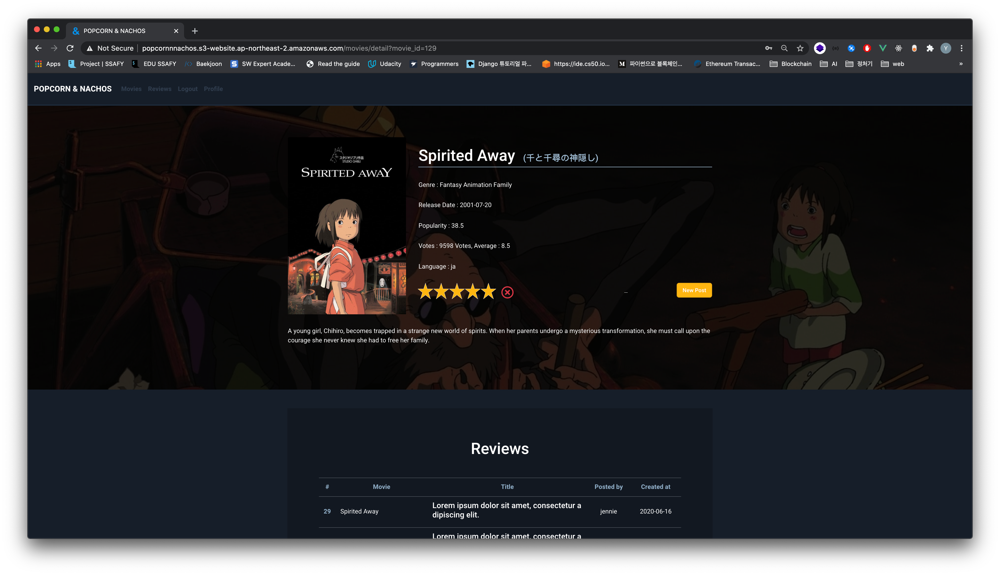

​				:small_red_triangle: 영화 상세정보 페이지

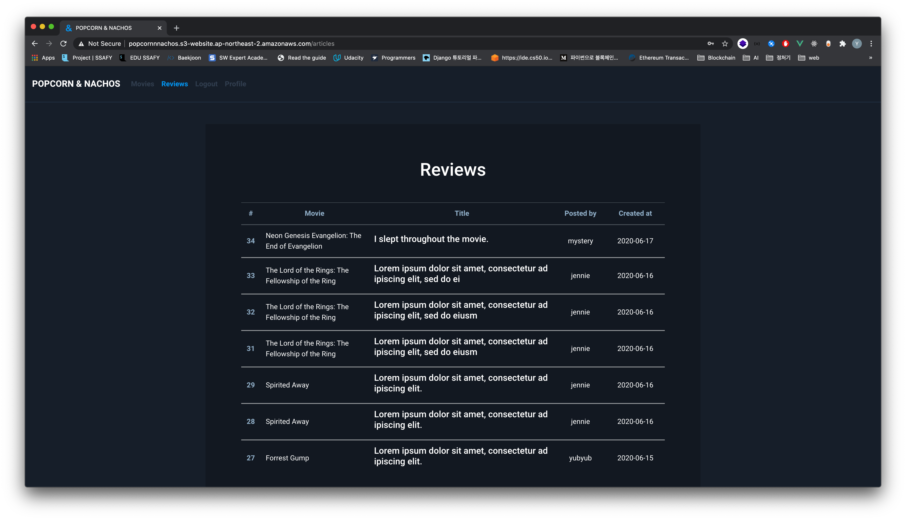

​				:small_red_triangle: 영화 리뷰 페이지

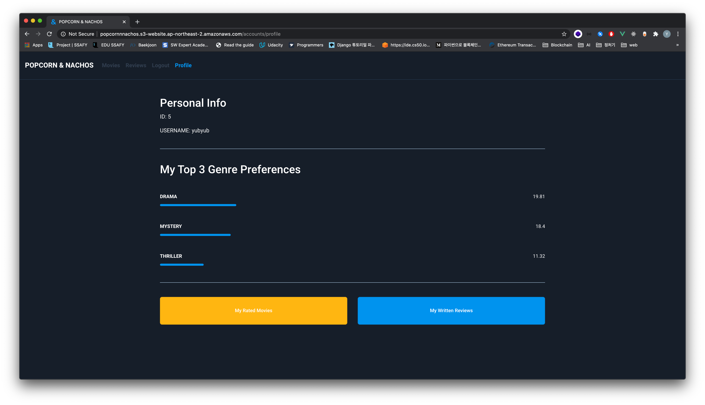

​				:small_red_triangle: 프로필 페이지

>  평점이 높은 영화들을 장르별로 분류하여 제공하고, 영화 상세정보 및 후기를 조회할 수 있으며 평점을 남길 수 있습니다.  
>
> 사용자가 평점 및 후기를 남긴 영화들을 바탕으로 사용자가 선호하는 장르들의 영화를 추천합니다.
>
> 사이트에 올라온 후기들을 조회할 수 있으며, 해당 글에 달린 댓글을 조회, 생성, 수정 및 삭제할 수 있습니다. 본인이 작성한 후기는 수정 및 삭제할 수 있습니다.
>
> 프로필 페이지에서 사용자가 좋아하는 장르 3개, 사용자가 평점을 남긴 영화들, 그리고 후기글을 확인할 수 있습니다. 

### :building_construction: Architecture

#### :pushpin: Model

.png)

​				:small_red_triangle: 데이터베이스 모델 구조

#### :pushpin: Architecture

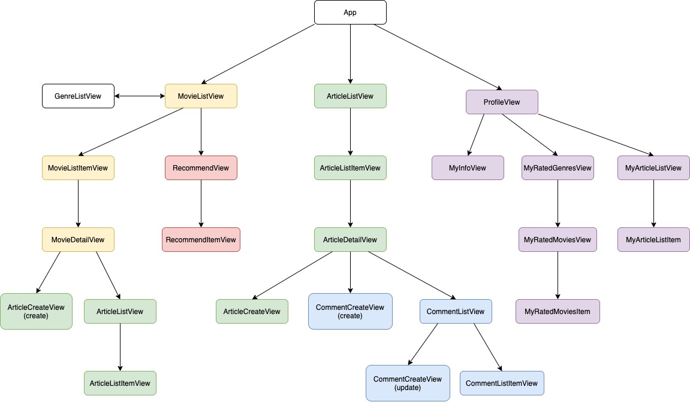

​				:small_red_triangle: 웹 서비스 아키텍처 

## Description

### :clapper: Movies

#### :pushpin: List of Movies

##### 		Movie by Genre

​				:small_red_triangle: Animation 장르를 선택한 화면 

> 따로 설정이 되어있지 않은 경우 모든 장르의 영화들을 보여주며, 특정 장르를 선택하는 경우 해당 장르의 영화들을 보여줍니다.

#### :pushpin: Recommendations

​				:small_red_triangle: Carousel 형태로 영화 추천이 나온다.

> 사용자가 영화들에 준 평점을 바탕으로 장르 선호도를 계산하여, 선호도가 높은 장르 최대 3개를 바탕으로 영화를 추천합니다.
>
> 추천하는 영화는 10개이며, 사용자가 기존에 준 평점이 없는 경우 랜덤으로 영화를 선정합니다.
>
> 영화 선호도 알고리즘은 하단에 기술하였다. 

#### :pushpin: Movie Ratings

##### Rating Algorithm

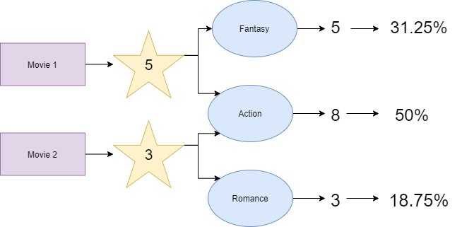

​				:small_red_triangle: 영화 선호도 계산 방법

> 각 영화가 여러 장르를 포함할 수 있으며, 선호도로를 계산할 때 영화에 평점을 매기면 장르별로 평점을 합산하여 가중치를 주도록 한다. 모든 영화에 합산된 총 점수에 대한 각 장르별 선호도 비율을 계산한다.
>
> 영화 선호도는 영화 추천과 프로필 페이지의 My Top 3 Genre Preferences 에 사용하였다. 

##### Star Rating

​				:small_red_triangle: 영화 리스트 페이지에서 별점을 주는 경우

​				:small_red_triangle: 영화 상세정보 페이지에서 별점을 주는 경우

> `vue-star-rating` 을 사용하여 사용자가 직관적으로 별점을 줄 수 있도록 하였다. 
>
> 영화 리스트 페이지에서는 각 영화에 마우스를 호버하면 기존에 준 평점을 볼 수 있으며, 이를 수정할 수 있다. 기존에 평점을 주지 않았을 경우에는 새로 평점을 줄 수 있다. 
>
> 영화 상세정보 페이지에서는 기존에 준 평점을 볼 수 있으며, 이를 수정 및 삭제할 수 있다. 기존에 평점을 주지 않았을 경우에는 새로 평점을 줄 수 있다. 

#### :pushpin: Movie Detail

​				:small_red_triangle: 영화 상세정보 페이지 - 평점과 리뷰가 있는 경우 

​				:small_red_triangle: 영화 상세정보 페이지 - 평점과 리뷰가 없는 경우 

> 영화에 대한 상세정보를 보여주는 페이지이다. 
>
> 해당 영화의 평점을 생성, 수정 및 삭제할 수 있으며, 리뷰 또한 새로 작성할 수 있다.
>
> 하단에는 해당 영화에 대해 작성된 리뷰들을 보여주며, 제목을 클릭하면 리뷰 상세 페이지로 넘어간다. 기존에 작성된 리뷰가 없는 경우 'No Reviews Yet. Be the first to write a review for this movie!'라는 메세지가 나온다. 

### :memo: Reviews

#### :pushpin: List of Reviews

​				:small_red_triangle: 영화 리스트 페이지 - 모든 영화들의 리뷰들을 보여줌 

​				:small_red_triangle: 영화 상세정보 페이지 - 페이지 하단에 해당 영화에 대한 리뷰들을 보여줌 

> 영화 리뷰들을 보여주는 페이지이다.
>
> 네비게이션바의 Reviews를 통해 들어가는 경우 모든 영화들에 대한 리뷰들을 보여준다.
>
> 영화 상세 페이지를 통해서는 해당 영화에 대한 리뷰들을 보여준다. 

#### :pushpin: Review Detail

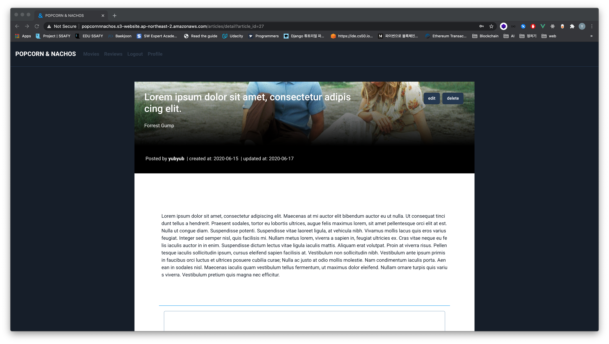

​				:small_red_triangle: 영화 리뷰 상세정보 페이지 상단 - 리뷰 글 정보 

> 영화 상세정보 페이지는 크게 리뷰 컴포넌트와 댓글 컴포넌트로 나눌 수 있다.
>
> 페이지 상단에서는 글 제목, 영화 제목, 작성자, 글 작성시간 및 수정시간, 그리고 글 내용을 확인할 수 있다. 또한 edit 버튼과 delete 버튼을 통해 글을 수정하거나 삭제할 수 있다.

#### :pushpin: Edit & Delete Review

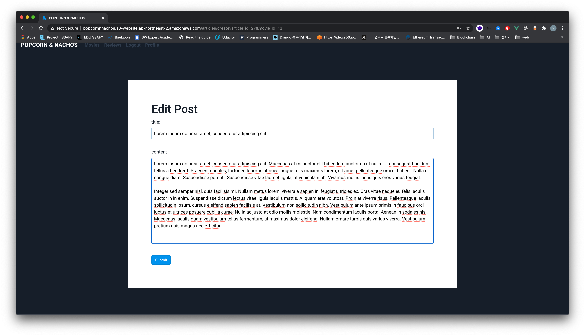

​				:small_red_triangle: 영화 리뷰 수정 페이지

> Edit 버튼을 클릭하면 다음과 같이 리뷰를 수정할 수 있다. 
>
> 제목 및 내용을 수정할 수 있으며, 수정이 완료되면 영화 리뷰 상세페이지의 'updated at' 정보가 바뀐다. 

#### :pushpin: Comments

##### 	New Comment & List of Comments

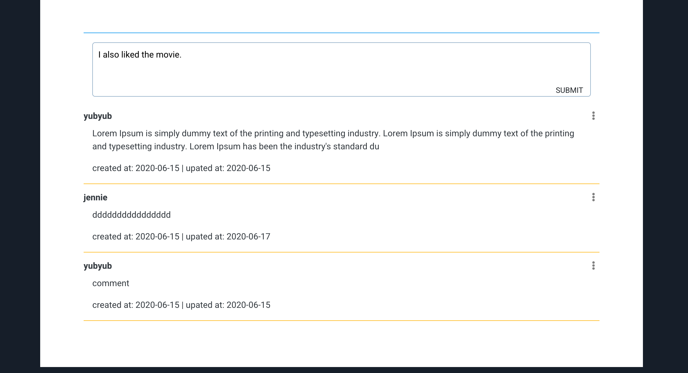

​				:small_red_triangle: 영화 리뷰 상세정보 페이지 하단 - 댓글 정보 

>  페이지 하단에서는 글에 대한 댓글을 작성할 수 있으며, 댓글을 작성한 후 submit 버튼을 누르면 댓글이 작성된다. 그 밑에는 기존에 작성된 댓글들을 볼 수 있다. 

##### 	Edit & Delete Comment
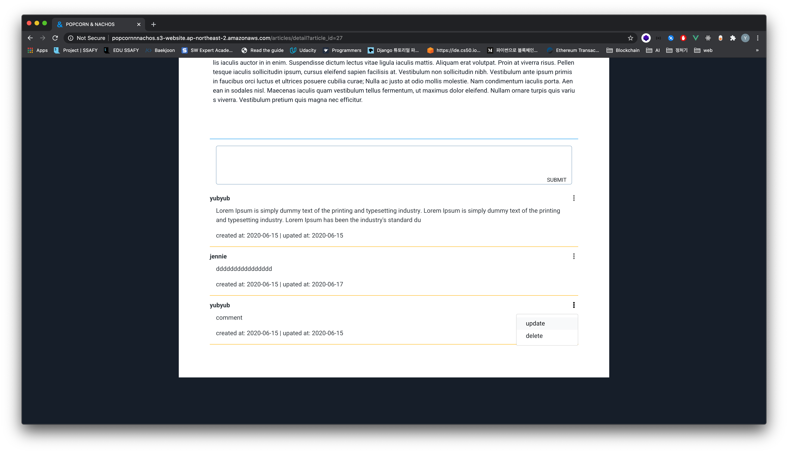

​				:small_red_triangle: 영화 리뷰 상세정보 페이지 하단 - 댓글 수정 및 삭제

> 자신이 작성한 댓글의 경우 오른쪽의 버튼을 클릭하면 댓글을 수정하거나 삭제할 수 있다. 

### :information_desk_person:  Profile

####  :pushpin: My Top 3 Genre Preferences 

​				:small_red_triangle: 프로필 페이지 

> 사용자가 준 평점들을 바탕으로 영화 선호도를 높은 순서대로 3개를 보여준다.

#### :pushpin: My Rated Movies

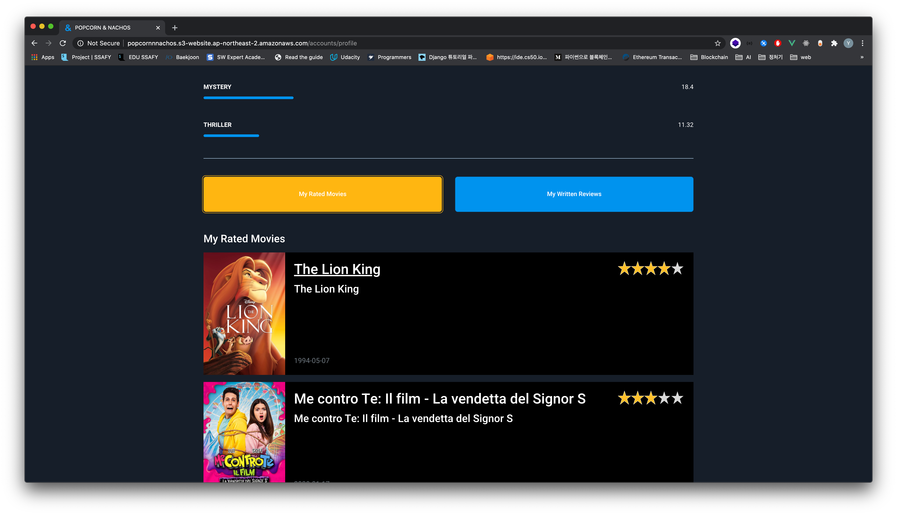

​				:small_red_triangle: 프로필 페이지 - My Rated Movies

> 'My Rated Movies' 버튼을 클릭하면 평점을 줬던 영화들과 평점을 확인할 수 있다.
>
> 영화 제목을 클릭하면 영화 상세 페이지를 볼 수 있다.

#### :pushpin: My Written Reviews

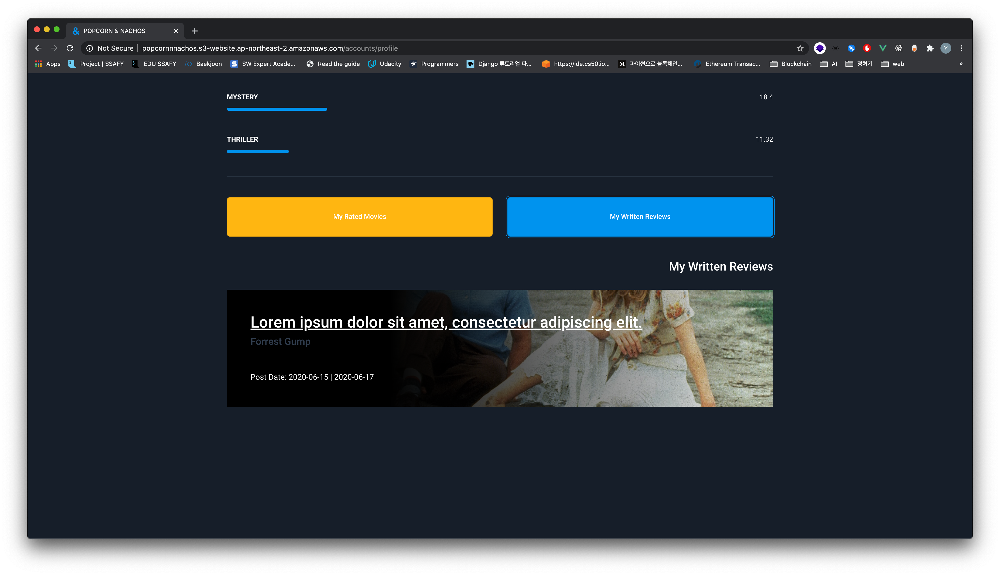

​				:small_red_triangle: 프로필 페이지 - My Written Reviews

> 'My Written Reviews' 버튼을 클릭하면 사용자가 작성했던 리뷰들을 확인할 수 있다.
>
> 리뷰 제목을 클릭하면 리뷰 상세 페이지를 볼 수 있다.

